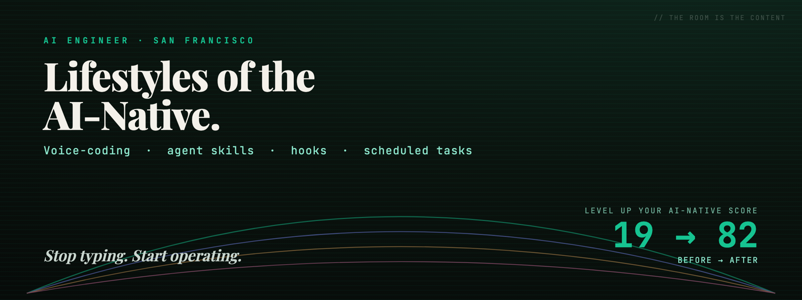
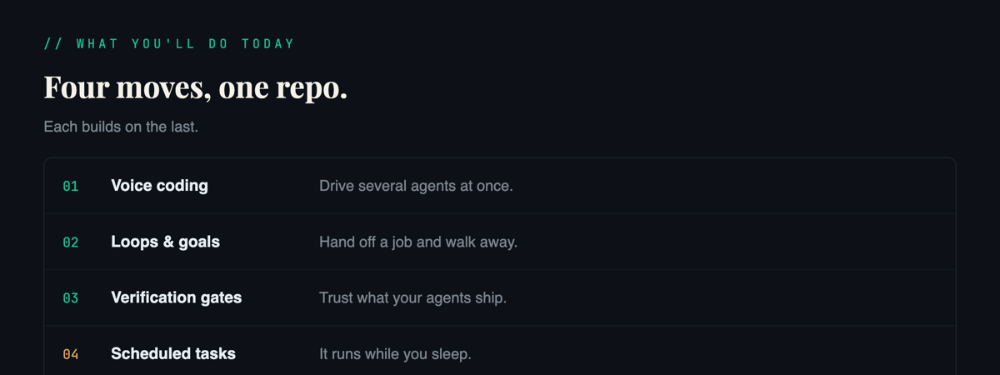
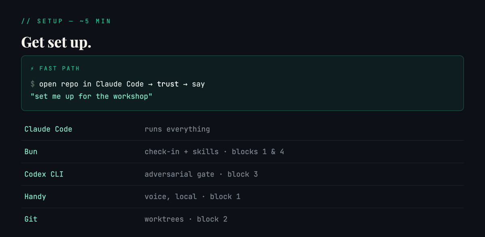
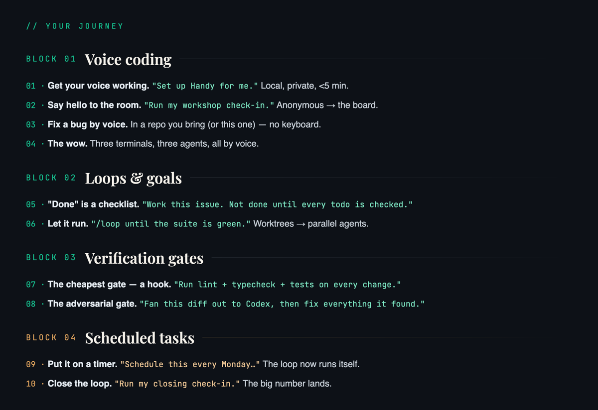
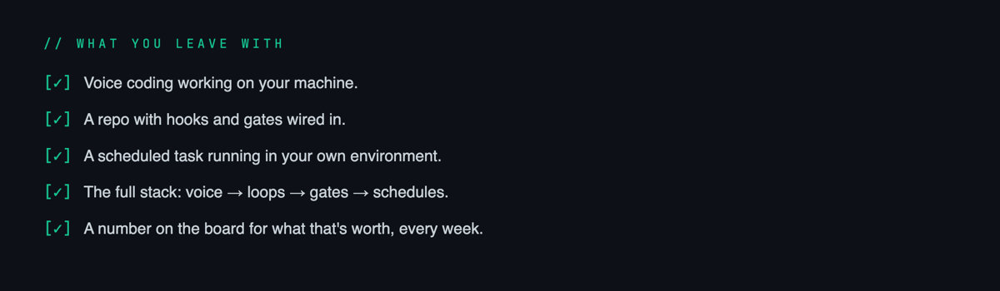

<div align="center">

<a href="https://aie-deck.workos-internal.workers.dev"></a>

<p>
  
  
  
</p>

### ▸ Open these now

**[🖥&#65039; Slides](https://aie-deck.workos-internal.workers.dev)** &nbsp;·&nbsp; **[📊 Live board](https://aie-board.workos-internal.workers.dev)** &nbsp;·&nbsp; **[📖 Glossary — ask it anything](https://aie-glossary.workos-internal.workers.dev)**

</div>

---



<p align="center"><b>Your check-ins light up the <a href="https://aie-board.workos-internal.workers.dev">live board</a></b> &nbsp;—&nbsp; the room's toil &nbsp;·&nbsp; what to automate &nbsp;·&nbsp; hours/week reclaimed</p>

---



You need **[Claude Code](https://claude.com/claude-code)** installed and signed in. Everything else, let Claude install.

<details open>
<summary><b>✅ Recommended — clone it and let Claude set you up</b></summary>

<br/>

**1. Clone the repo and launch Claude Code inside it:**

```bash
git clone https://github.com/workos/aie-ai-native-workshop.git
cd aie-ai-native-workshop
claude          # starts Claude Code in the repo
```

**2. On first launch, you'll see three prompts (once each):**
- **Trust** the workspace → accept (loads the workshop skills + permissions).
- **`aie-coach` MCP server** → choose **"Use this and all future MCP servers in this project."**
- **Tool calls** → approve them as they appear.

> ⚡ Want it hands-off? Launch with **`claude --dangerously-skip-permissions`** instead — you trust this repo, so it skips every prompt.

**3. Then just say:**

> *"set me up for the workshop"*

The `setup-workshop` skill installs and verifies the dev tools — **Bun, the Codex CLI, and git** — confirms the repo is wired, and prints a status report. *(If it just installed Bun, quit and re-run `claude` once so the coach can launch.)* Then say **"run my workshop check-in"** and you're in. *(Getting your voice working — Handy — is the first hands-on moment of Block 1, not setup.)*

</details>

<details>
<summary>🔧 Prefer to install by hand?</summary>

<br/>

Get each tool: **[Bun](https://bun.sh)** · **[Codex CLI](https://github.com/openai/codex)** · **[Handy](https://handy.computer)** · git. Or run:

```bash
# Bun — the check-in tool + skills run on it (blocks 1 & 4)
curl -fsSL https://bun.sh/install | bash

# Codex CLI — the Block 3 adversarial-review gate
npm i -g @openai/codex && codex login

# Handy (voice) — or just ask Claude in the repo:  "set up Handy for me"
# Git — check you have it:  git --version
```

Then **open this repo in Claude Code and trust it** — that auto-loads the workshop skills, the `ideation` plugin, and the `aie-coach` coach (approve it when prompted).

</details>

---



<p align="center">
  <b>Deeper notes →</b>
  <a href="curriculum/01-voice-coding.md">Block 1 · Voice</a> &nbsp;·&nbsp;
  <a href="curriculum/02-loops-and-goals.md">Block 2 · Loops &amp; goals</a> &nbsp;·&nbsp;
  <a href="curriculum/03-verification-gates.md">Block 3 · Gates</a> &nbsp;·&nbsp;
  <a href="curriculum/04-scheduled-tasks.md">Block 4 · Schedules</a>
</p>

> 🛠️ **Bring a repo to work in** — a side project or work repo (no good one handy? clone any small project). The moves apply to any stack.

---

## 🤖 Meet your coach

An **opt-in** coach rides along in your terminal:

- 💬 **Interviews you** — a few quick questions, walking in and at the close.
- 📊 **Scores your setup** — how AI-native are you? One number, **before → after**.
- 📈 **Feeds the [live board](https://aie-board.workos-internal.workers.dev)** — your arc, next to the whole room's.
- 🎈 **For fun** — and it quietly powers the data viz.

> Under the hood it's a **local MCP server** (`aie-coach`) — 7 tools, in [`native/`](native/). Full tool list + scoring → **[native/README.md](native/README.md)**.

**🔒 Your privacy, plainly:**

- The score is a **local scan** of your own Claude setup (hooks? a `CLAUDE.md`? worktrees?).
- Only the **score numbers** and the **answers you confirm** leave your machine.
- **Never** your files, `git log`, or transcripts.
- Skip it entirely and still do every block.

---



---

<div align="center">

<sub><code>●</code>&nbsp; Now stop reading and go talk to your computer. &nbsp;🎙&#65039;</sub>

<sub>
  <a href="https://aie-deck.workos-internal.workers.dev">Slides</a> ·
  <a href="https://aie-board.workos-internal.workers.dev">Board</a> ·
  <a href="https://aie-glossary.workos-internal.workers.dev">Glossary</a> &nbsp;|&nbsp;
  <a href="curriculum/">Curriculum</a> ·
  <a href="skills/">Skills</a> ·
  <a href="board/">Board code</a> ·
  <a href="glossary/">Glossary code</a> &nbsp;|&nbsp;
  Running this workshop? → <a href="docs/facilitator.md">Facilitator guide</a>
</sub>

</div>
