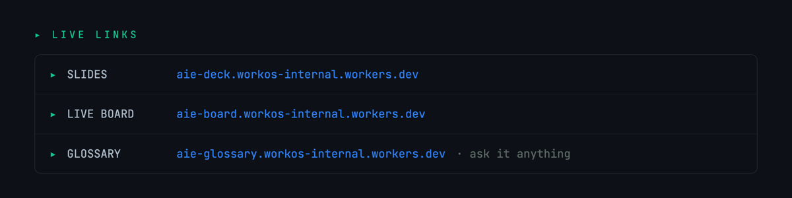

<div align="center">

<a href="https://aie-deck.workos-internal.workers.dev"></a>

<p>
  
  
  
</p>

</div>



<p align="center">
  <a href="https://aie-deck.workos-internal.workers.dev"><b>Slides</b></a> &nbsp;·&nbsp;
  <a href="https://aie-board.workos-internal.workers.dev"><b>Live board</b></a> &nbsp;·&nbsp;
  <a href="https://aie-glossary.workos-internal.workers.dev"><b>Glossary</b></a> — ask it anything
</p>


<details>
<summary><b>Prefer to install by hand?</b></summary>

```bash
# Bun — the check-in tool + skills run on it (blocks 1 & 4)
curl -fsSL https://bun.sh/install | bash

# Codex CLI — the Block 3 adversarial-review gate
npm i -g @openai/codex && codex login

# Handy (voice) — just ask Claude in the repo:  "set up Handy for me"
# Git — check you have it:  git --version
```

Then **trust this repo in Claude Code** — that auto-loads the workshop skills and the `ideation` plugin.

</details>


<p align="center">
  <b>Deeper notes:</b>
  <a href="curriculum/01-voice-coding.md">Block 1</a> &nbsp;·&nbsp;
  <a href="curriculum/02-loops-and-goals.md">Block 2</a> &nbsp;·&nbsp;
  <a href="curriculum/03-verification-gates.md">Block 3</a> &nbsp;·&nbsp;
  <a href="curriculum/04-scheduled-tasks.md">Block 4</a>
</p>


> 🔒 **Your privacy.** The check-in only ever sends **what you type and confirm** — anonymous, with a random id. Nothing is scanned off your machine: no repos, no `git log`, no transcripts. Skip it and still do every exercise.

---

<div align="center">

<sub><code>●</code>&nbsp; Now stop reading and go talk to your computer. &nbsp;🎙️</sub>

<sub>Running this workshop? → <a href="docs/facilitator.md">docs/facilitator.md</a> &nbsp;·&nbsp; Code → <a href="board/">board</a> · <a href="glossary/">glossary</a> · <a href="skills/">skills</a> &nbsp;·&nbsp; <a href="curriculum/">curriculum</a></sub>

</div>
