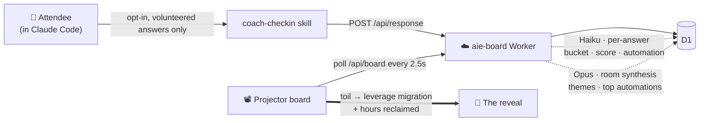

<div align="center">

<h1>The AI-Native Engineer</h1>

<p><em>An interactive Claude Code workshop — stop typing, start operating.</em></p>

<p>
  
  
  
</p>

<p>
  
  
  
</p>

<sub>Delivered by <strong>Zachary Proser</strong> · <strong>Nick Nisi</strong></sub>

</div>

---

## What this is

A room full of engineers stops typing and starts **operating**: driving Claude by
voice, running multi-step jobs to a checklist, wrapping agents in verification gates,
and scheduling the work so it runs without them. By the end, everyone has assembled
the full operator stack **once, end to end** — and the [live board](board/) shows the
room exactly how many engineering-hours a week they just learned to reclaim.

It is **not a talk.** Every block is hands-on. One presenter drives the same repo the
whole way through (so the recording is one clean journey), and the room's own
volunteered data — never anything scanned off a machine — drives the projector.

## The day at a glance

```mermaid
gantt
    title The AI-Native Engineer — Run of Show (~90 min · offsets from kickoff)
    dateFormat H:mm
    axisFormat +%H:%M
    section Open
    The pitch in one breath           :done, 0:00, 5m
    section Hands-on
    Block 1 — Voice coding            :active, 0:05, 25m
    Block 2 — Loops & goals           :0:30, 25m
    Block 3 — Verification gates      :0:55, 25m
    section Finale
    Block 4 — Scheduled tasks         :crit, 1:20, 20m
    Close — the board's before→after  :1:40, 5m
```



## The arc

Four blocks, one repo, building on each other. Each links to its curriculum page.

| # | Block | The move | The aha |
|---|-------|----------|---------|
| 1 | [**Voice coding**](curriculum/01-voice-coding.md) | Install [Handy](https://handy.computer) (free, local), fix a bug by voice, then drive **several agents at once** across tabs. | Your voice removes the bottleneck — you can manufacture work in parallel. |
| 2 | [**Loops & goals**](curriculum/02-loops-and-goals.md) | Hand the agent a checklist it can't declare done early, and a `/loop` that self-paces. Run them on parallel worktrees. | "Done" is a checklist you encode, not a vibe the model claims. |
| 3 | [**Verification gates**](curriculum/03-verification-gates.md) | A hook that lints/typechecks/tests every change; an adversarial **Codex** review on risky diffs. | Operators trust the gates, not the model's confidence. |
| 4 | [**Scheduled tasks**](curriculum/04-scheduled-tasks.md) | Schedule the *same* work you just built so it runs every Monday, while you sleep. | The loop you ran by hand now runs itself — and you keep it. |

## The live board — the room is the content

Each attendee runs an opt-in [coach check-in](skills/coach-checkin/) walking in and again
at the close. Their answers feed a Cloudflare-hosted projector board that reveals the
room to itself — where the toil is, what to automate, and the marquee number:
**total engineering-hours/week reclaimed.**



> **Privacy is the hard line.** Only what a participant *types and confirms* is ever sent.
> No repo scans, no `git log`, no transcript reads — volunteered answers only. See
> [`docs/design.md`](docs/design.md).

## Quickstart

### Run the workshop (as an attendee)

```bash
# 1. Trust this repo in Claude Code — that auto-loads the skills + the `ideation` plugin.
# 2. Set up voice:
#    > "Set up Handy for me."          → runs the setup-handy skill
# 3. Opening check-in (anonymous, opt-in):
#    > "Run my workshop check-in."     → runs coach-checkin, posts to the board
# 4. …work Blocks 1–4…
# 5. Closing check-in:
#    > "Run my closing check-in."
```

### Stand up the live board (facilitator)

You're logged into the **WorkOS Internal** Cloudflare account via `wrangler login`
(confirm: `npx wrangler whoami`). Full runbook in [`board/README.md`](board/README.md).

```bash
cd board && npm install
npm run db:create            # create D1, paste database_id into wrangler.jsonc
npm run migrate:remote       # apply the schema
echo -n "<submit-token>"  | npx wrangler secret put SUBMIT_TOKEN
echo -n "<admin-token>"   | npx wrangler secret put ADMIN_TOKEN
echo -n "<anthropic-key>" | npx wrangler secret put ANTHROPIC_API_KEY
npm run deploy               # builds the frontend → public/, then deploys

# Point the check-in skill at the deployed board:
export WORKER_URL="https://aie-board.<your-subdomain>.workers.dev/api/response"
export WORKER_TOKEN="<submit-token>"
```

### Develop & verify locally

```bash
npm test                     # coach-checkin script tests (node --test)
npm run lint                 # markdownlint everything CI would

cd board
npm run dev                  # build + wrangler dev; append ?sim to force the simulator
# Projector check with canned data (zero AI spend):
curl -s -X POST $BASE/api/admin/seed  -H "Authorization: Bearer <admin-token>" | jq
curl -s -X POST $BASE/api/admin/clear -H "Authorization: Bearer <admin-token>" | jq
```

## Repository map

| Path | What's inside |
|------|---------------|
| [`curriculum/`](curriculum/) | The four blocks — [voice](curriculum/01-voice-coding.md) · [loops & goals](curriculum/02-loops-and-goals.md) · [gates](curriculum/03-verification-gates.md) · [schedules](curriculum/04-scheduled-tasks.md) |
| [`skills/`](skills/) | [`setup-handy`](skills/setup-handy/) (voice on-ramp) · [`coach-checkin`](skills/coach-checkin/) (opt-in interview) · `ideation` (plugin) |
| [`board/`](board/) | The live room board — Cloudflare Worker + D1 + two-tier AI, D3 projector frontend |
| [`mcp-coach/`](mcp-coach/) | *(planned)* the coach as an in-session MCP server + a one-command installer |
| [`exercises/`](exercises/) | *(stub)* the local-first app attendees build on, with checklist issues |
| [`docs/`](docs/) | [run of show](docs/run-of-show.md) · [design notes](docs/design.md) |
| [`post-workshop/`](post-workshop/) | the follow-up check-in + roadmap (workshop RAG, keep-the-repo) |

## The operator stack

What "AI-native" actually means here — the glue, not the off-the-shelf parts:

- **Voice** as the input layer — talk at ~180 wpm, hands off the keyboard.
- **Goals & loops** to hand off multi-step work and walk away.
- **Verification gates** (hooks + adversarial review) so you trust the output.
- **Scheduled tasks** so the work recurs without you.
- **A coach** that meets you where you are and a **board** that shows the room its own gains.

---

<div align="center">
<sub>Made with care — and Claude Code. 🔥</sub>
</div>
